<!doctype html>
<html lang="en">
<head>
	
<meta name="viewport" content="width=device-width, initial-scale=1.0">
<meta charset="utf-8">
<title>Untitled Document</title>
	<meta name="viewport" content="width=device-width, initial-scale=1.0">
<link rel="stylesheet" type="text/css" href="css/style.css">
	<link rel="stylesheet" href="https://cdnjs.cloudflare.com/ajax/libs/font-awesome/4.7.0/css/font-awesome.min.css">
	<link href="https://fonts.googleapis.com/css?family=Bebas+Neue&display=swap" rel="stylesheet">
	<link href="https://fonts.googleapis.com/css?family=Varela&display=swap" rel="stylesheet">
	<link href="https://fonts.googleapis.com/css?family=Roboto&display=swap" rel="stylesheet">
	<link href="https://fonts.googleapis.com/css?family=Poppins:700&display=swap" rel="stylesheet">
	<link href="https://fonts.googleapis.com/css?family=Roboto:400i&display=swap" rel="stylesheet">
</head>

<body>

	<main>
		
			<header>
				

					
				

				
				<nav>
					<a href="#hero">Home</a>
					<a href="#news">News</a>
					<a href="#leaderboard">Leaderboard</a>
					<a href="#partnership">Partnership</a>
					<a href="#adidas-athletes">Athletes</a>
					<a href="#adidas-streetball">About</a>
				</nav>
			</header>
			
			

				

					
					
					
 <h1>Hoop With Adidas</h1> 
						<h2>Main Event </h2>
						<h3>20 Of July </h3>
						<h4>Venice Beach </h4> 
					

						
			
			
				

					

					
    
				

			

			
			<section id="news">
				
				<h1>NEWS AND INFORMATION</h1>
				

					

					

					<h3 class="big-news-h">Lakers Take The Lead</h3 >
						

				
				

					

					

					<h3 class="big-news-h">Boston Wins The Series</h3>
						

				
						<!--

						<h3 class="big-news-h">Lakers Take The Lead</h3 >
						

				     

						 <h3 class="big-news-h">Boston Wins The Series</h3>
						
-->
					 
				
				

						
	
						

					<h4 class="small-headings">Paul George fires for 35 points to lead Clippers to Game 5</h4>
					

				
				

					
	
					

					<h4 class="small-headings">Giannis named Defensive Player of the Year</h4>
						
	
				
				

					

					

					<h4 class="small-headings">LA street set to be renamed Kobe Bryant Boulevard in honour of NBA star</h4>
				      

				<!--

					<h4 class="small-headings">Paul George fires for 35 points to lead Clippers to Game 5 blow out win over Mavericks</h4>
					

				

					<h4 class="small-headings">Giannis named Defensive Player of the Year</h4>
				

				

					<h4 class="small-headings">LA street set to be renamed Kobe Bryant Boulevard in honour of NBA star</h4>
				
-->
				
		</section>
		
		
		
		
		
		
		<section id="leaderboard">
			<h1>PLAYER LEADERBOARD</h1>
			
			

						
						

							<h2>PPG</h2>
					
						<h3>KOBE BRYANT</h3>
						
27.5

					

					
					

						<h2>APG</h2>
					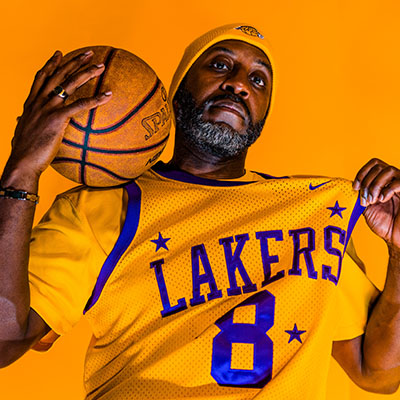
						<h3>RAJON RONDO</h3>
						
9.5

					

				
						

							<h2>RPG</h2>
					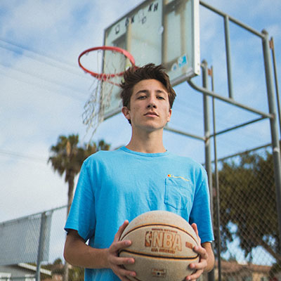
						<h3>DWIGHT HOWARD</h3>
						
12.5

					

				
				

					<h2>SPG</h2>
					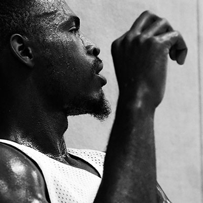
						<h3>KEVIN DURANT</h3>
						
3.0

					

				
				

					<h2>BPG</h2>
					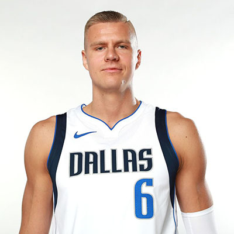
						<h3>KRISTAPS PORZINGIS</h3>
						
3.2

					

		
			
			
		</section>
		
		<section id="partnership">
			<h1>MEET YOUR IDOLS</h1>
			
				
			

			<h2>Damian Lillard</h2>
				
Thanks to our partnership NBA superstar Damian Lillard will take part in the event. You wil have the chance to meet your idol and hear his story of overcoming  tough times in his life and how basketball has impacted his life. Damian Lillard, an American professional basketball player is one of the plethoras of young talents in the NBA, eager to set an indelible imprint in the game. 

			

			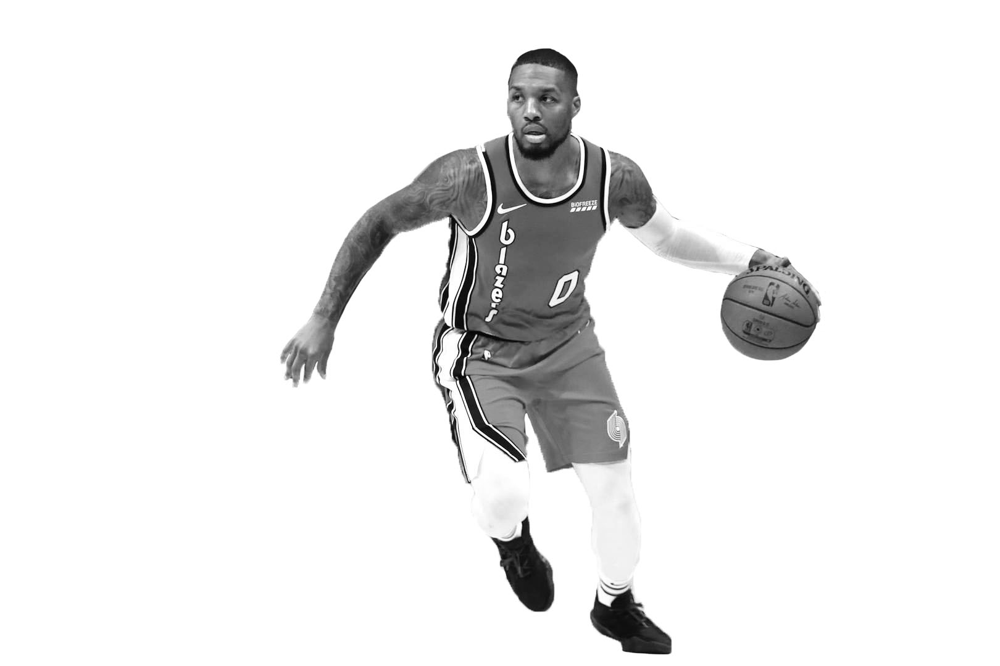
			
			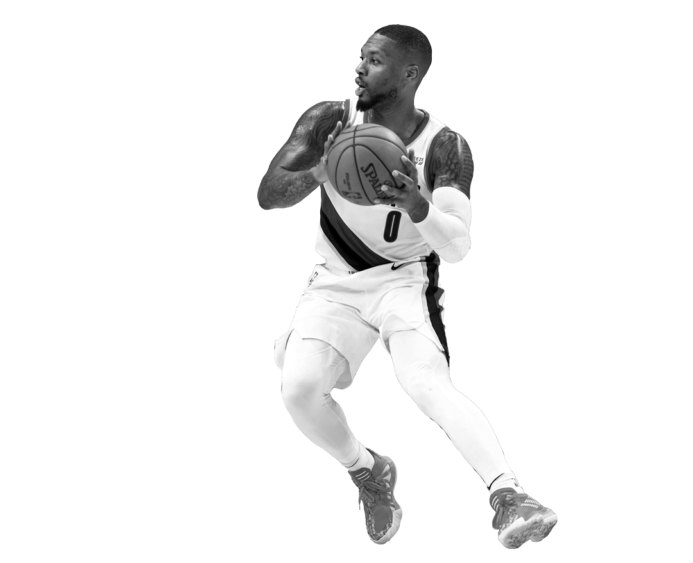
			

				<h2>Work Ethic</h2>
			
While no doubt many players work hard to reach the very peak of the game, some work even harder. Damian is one of such players who have established a reputation for his outstanding intellect, amazing wit and exceptional style of play. 

			

			
			
			

			<iframe  height="675" src="https://www.youtube.com/embed/bnU0qchCLRA?autoplay=1"  
			allow="accelerometer; autoplay; encrypted-media; gyroscope; picture-in-picture" allowfullscreen></iframe>
			

		
		</section>
		
		<section id="adidas-athletes">
		<h1>ADIDAS ATHLETES</h1>
			
			
			
			

				<h4>Ray Allen</h4> 
					
					
"Basketball has done so much more for me.  Basketball helped build my character by showing me how to push through adversity, positively channel my emotions, and successfully work with others.  I can even say basketball has kept me away from ever doing drugs.  I know that some people use drugs as a temporary escape from the stressful realities of life...
 
				

			
			

				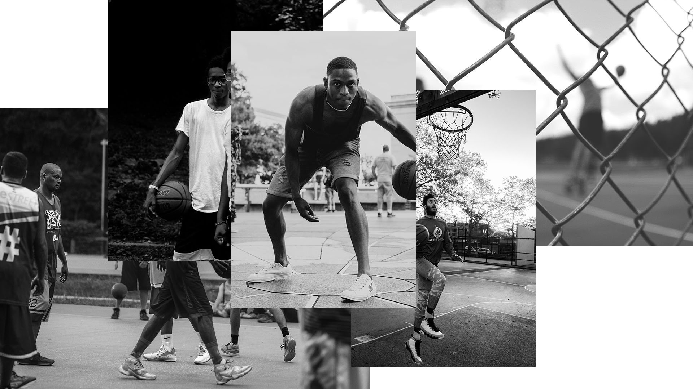	
			

			

			
Basketball has always been my temporary escape blocking my mind from the outside world holding my undivided attention for hours at a time.  I am truly thankful God decided to use basketball to change my life because I know how different my life could have turned out.  Hopefully during my time here and throughout my life I can encourage some young boy or girl to use sports the same way that I have." 

			

			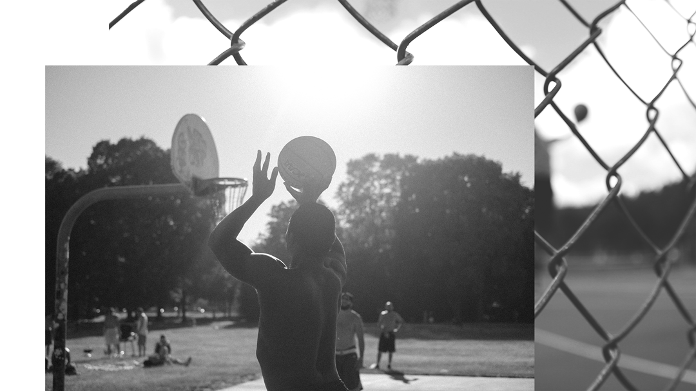
			
				
			
			
			
			
		</section>
		
		
		<section id="adidas-streetball">
			<h1>ADIDAS STREETBALL</h1>
			
			

			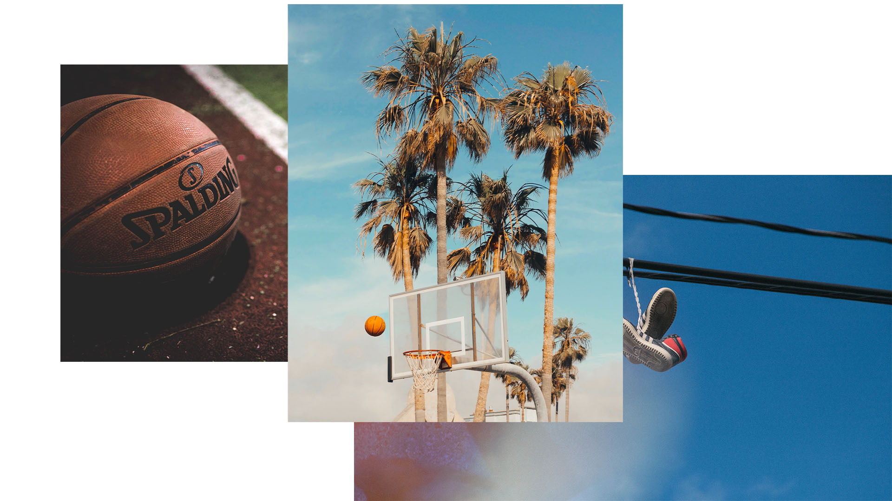
			

			

				<h2>Our Mission</h2>
				
Adidas is committed changing future of young athletes across the globe in key cities like London, Paris, LA, New York, Tokyo, Shanghai. Sport is used for being a catalyst for change in young peoples lives and how Adidas can improve the fabric of the city. 

			
			
			

			
			

			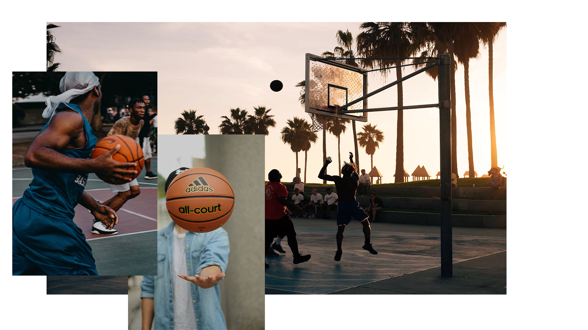
			

			

				<h2>Why Los Angeles</h2>
				
LA is well know for producing some of the greatest basketball athletes. City has two NBA teams, Los Angeles Clippers and  Los Angeles Lakers. Lakers are one of the most popular sports team in the whole world, they have won 16 NBA championships and produced 24 Hall of famers like Kobe Bryant, Shaquille oneal, Magic Johnson and many more. LA has strong basketball culture, therefore Adidas believes basketball will be the factor to achieve their goal. 

			
			

		</section>
		
		<section id="contact-us">
			
			
			

			

    <h2>Contact Us</h2>
    
  

  

    

     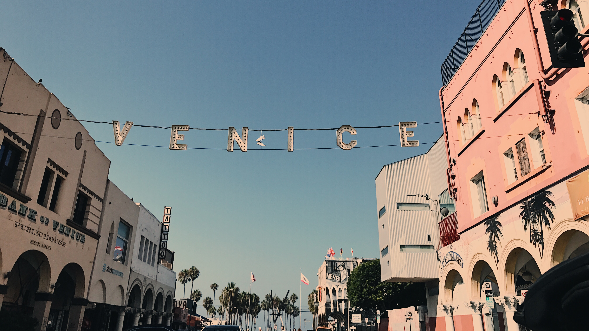
    

    

      <form action="/action_page.php">
        <label for="fname">First Name</label>
        <input type="text" id="fname" name="firstname" placeholder="Your name..">
        <label for="lname">Last Name</label>
        <input type="text" id="lname" name="lastname" placeholder="Your last name..">
        <label for="country">Country</label>
        <select id="country" name="country">
          <option value="australia">United Kingdom</option>
          <option value="canada">Canada</option>
          <option value="usa">USA</option>
        </select>
        <label for="subject">Subject</label>
        <textarea id="subject" name="subject" placeholder="Write something.." style="height:170px"></textarea>
        <input type="submit" value="Submit">
      </form>
    

  

				 
		    

		 
		
		
		</section>

			
		</main>
	</body>
	
	
</html>
